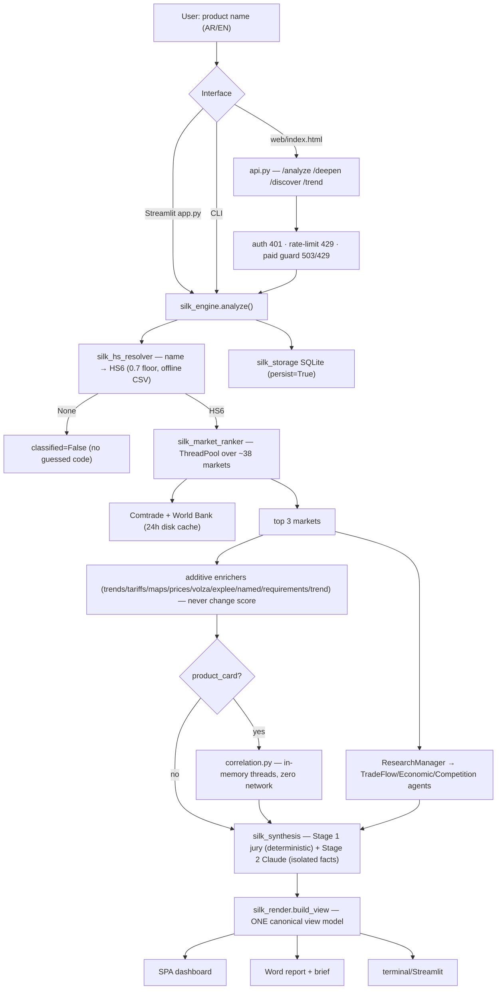

# Silk Market Intelligence — Full Project Audit (Phase 1)

> **الخلاصة التنفيذية:** المنصة اليوم أداة **فرز أسواق وتدفّقات تجارية أمينة المصدر** ببنية هندسية منضبطة (مبدأ «لا اختلاق» مطبَّق بنيويًّا، عزل حقن، فصل مدفوع/مجاني بنيوي، واجهة ثنائية اللغة محترفة) — لكنها **ليست بعد** منصة «دراسة سوق شاملة + محرّك قرار موزون». التقرير ينقصه نصف هيكل الدراسة الاحترافية (TAM/SAM/SOM، SWOT، تنظيمي، تسعير، شرائح، مخاطر)، ومحرّك «القرار» الحالي عدّاد تغطية/حكم LLM لا نموذج ترجيح، وطبقة البيانات تُجلَب لحظيًّا بلا مخزن حقائق ولا جدولة — وواجهة Comtrade المجانية غير صالحة عمليًّا لتوزيع 38 سوقًا (مُثبَت تشغيليًّا: 2/30 فقط تنجح بلا مفتاح).

*Audited at `rebuild` = copy of `main` (deployed to Railway: `web-production-29245.up.railway.app`). Method: four parallel deep-read audits (architecture/data-flow · data layer/sources · API/security/ops · UI/reports/tests) + live production evidence from an actual deployed run.*

---

## 1. Project purpose — current vs. target

**Target (per VISION + owner):** a professional platform that, for any Saudi product, produces (a) a **comprehensive market report** — executive summary, market size (TAM/SAM/SOM), growth trends, competitor analysis, SWOT, regulatory environment, pricing analysis, customer segments, distribution channels, risks — and (b) a **market-entry decision**: Go / No-Go / Conditional-Go from a weighted scoring model, with confidence, key risks, and first steps.

**Current reality:** an honest **market-shortlisting engine**. It classifies a product to HS6, ranks ~38 markets by a 4-component weighted score over real Comtrade/World Bank data, enriches the top 3 with optional agents (trends, tariffs, prices, named candidates, compliance checklist), correlates against the user's product card, and emits a verdict (GO/WATCH/NO-GO) from a deterministic coverage-count jury plus an optional Claude judge. Outputs: bilingual SPA dashboard, Word report, one-page brief.

**The delta is substantial** (see §10): report content ≈ half missing vs. the professional template; no weighted decision rubric and no Conditional-Go class; no persistent fact store or scheduled data pipeline; keyless Comtrade unusable at fan-out scale.

---

## 2. Architecture

**Stack:** pure Python, stdlib-first. FastAPI+uvicorn+pydantic (lazy — `import api` works without them), `requests` (one pooled Session, 16 conns, `max_retries=0`), optional `pytrends`/`python-docx`/Streamlit, raw Anthropic Messages API (no SDK; model via `SILK_AI_MODEL`). SQLite (stdlib). Frontend: one 630-line vanilla-JS/CSS SPA (`web/index.html`), no framework, no build step.

**Layout:** flat repo root, ~33 modules in three tiers — data layer (`silk_data_layer[_v2]`, `silk_cache`, `silk_hs_resolver`), agents/reasoning (`silk_agents` + 12 `silk_*_agent` + `silk_synthesis`, `silk_ai_judge`, `correlation`, `silk_discovery`, `silk_trend`, `silk_context`), orchestration/output (`silk_engine`, `silk_market_ranker`, `silk_render`, `silk_reports`, `silk_storage`, `silk_quality`, `silk_usage`), interfaces (`api.py`, `app.py`, `web/`). Entry points: `uvicorn api:app` (serves UI + API same-origin), `python3 silk_engine.py`, `streamlit run app.py`.

**Evolution:** delivered in tested "waves" 0–9 (security baseline → structural paid/free enforcement → selective agents → correlation + unified synthesis → discovery → compliance → reports → multi-year trend → P0 hardening → perf → report/UI enrichment). 116 hermetic tests across 13 files.

### Data flow

**Scoring model (`silk_market_ranker`):** weights `market_size .40 / demand_capacity .25 / saudi_position .20 / competition(HHI, inverted) .15`; min-max normalized across rows; missing components skipped with weights renormalized; row confidence = present/4. Demand is per-capita income only (deliberate: population× made big economies dominate). Sort `(score, confidence)`.

---

## 3. Data layer

**Provenance model:** `DataPoint{value, source, confidence, note, retrieved_at}` travels with every number; `value=None, confidence=0.0` is the universal gap sentinel. **The no-fabrication doctrine is genuinely enforced structurally** — `BaseAgent.run` converts any exception into a tagged failed report (silent failure impossible); partial Comtrade records are dropped, never summed as 0; confidence lowered and annotated on partial sums. Weakness: confidence is a static per-source trust prior (WB .95, Comtrade .9, Serper .5, candidates .4) — never decays with staleness.

**Sources (12 wired layers):**

| # | Source | Module | Type | Key env |
|---|--------|--------|------|---------|
| 1 | UN Comtrade preview | silk_data_layer | free, throttled | — |
| 2 | UN Comtrade data | silk_data_layer | free key (~500/day) | `COMTRADE_API_KEY` |
| 3 | World Bank Indicators | silk_data_layer | free, open | — |
| 4 | WITS tariffs | silk_tariffs_agent | free, volatile | — |
| 5 | FAOSTAT | silk_faostat_agent | free; now often 401 → mostly dead | — |
| 6 | Google Trends | silk_trends_agent | free via fragile `pytrends` | — |
| 7 | Google Places | silk_maps_agent | free quota | `GOOGLE_MAPS_API_KEY` |
| 8 | Serper web search | silk_websearch_agent | free quota | `SEARCH_API_KEY` |
| 9 | SerpApi retail prices | silk_localprice_agent | **paid** | `LOCALPRICE_API_KEY` |
| 10 | Volza importers | silk_volza_agent | **paid** | `VOLZA_API_KEY` |
| 11 | Explee B2B | silk_explee_agent | **paid** | `EXPLEE_API_KEY` |
| 12 | Claude judge/report | silk_ai_judge/synthesis | paid, optional | `ANTHROPIC_API_KEY` |

Competitors/channels/importers agents piggy-back on Serper and return **0.4-confidence "unverified candidates"** — honest but thin. Requirements agent = offline 15-row L1 CSV (GCC + EU chain + Saudi exit) + optional live verify.

**Caching:** disk JSON, sha1 key, **uniform 24h TTL, only Comtrade + World Bank** — WITS/FAOSTAT/Maps/Serper/paid all uncached (every analysis re-pays them). No eviction/size cap. `data/cache/` also contains ~20 stale `analysis:*.json` files no current code writes (dead artifacts).

**⚠️ CONFIRMED structural gap — Comtrade keyless is unusable at scale** (matches production evidence: Trade agent 2/30 vs Economic 37/38):
- No key → `/public/v1/preview` (aggressively throttled); key → **switches endpoint** to `/data/v1/get` (~500/day). The key changes the endpoint, not just the quota.
- One analysis fires ~38 near-simultaneous Comtrade calls (ThreadPool 16, `max_retries=0`, no backoff) — the wave-8 concurrency optimization makes preview-tier throttling *worse*. Downstream (core agents ×3, trend ×5/market) pushes a full run past **50+ Comtrade requests**.
- Throttled calls silently become `[]` → "no data" gaps. Keyless mode is a demo, not production.

**Storage — split-brain:** `silk_storage.py` → `data/silk.db` (clean minimal schema: `analyses` + `market_scores`, parameterized SQL, additive migration) but **everything is JSON-blob-in-a-column**; no relational fact schema for markets/indicators/competitors. *(Correction to raw audit: the `data/silk_app.db` found on disk — users/sessions/jobs/vectors — is an **untracked local artifact from the parallel session branch's tests**, not part of `main`. `main` has exactly one storage module.)*

**Quality:** `silk_quality.py` — flag-only checks on the 4 ranker components (near-zero size = HS-mismatch signal, out-of-range share/HHI). Doesn't check staleness or enrichment layers.

---

## 4. API layer

13 endpoints (FastAPI, lazy-built). Pydantic on all POST/PATCH; extra fields dropped — used as a **security control**: `AnalyzeRequest` has no paid flags, so the free path is structurally incapable of paid spend. `/deepen` is the only paid path, guarded by contextvar + `BaseAgent`.

| Method/Path | Auth | Notes |
|---|---|---|
| GET /health, /resolve/{name}, /index, /sources | – | public by design; `/sources` leaks `key_present` booleans |
| POST /analyze, /deepen, /discover, /trend | ✅ | + rate-limit + paid guard |
| GET /analyses[, /{id}, /brief, /report.docx] | ✅ | 501 if python-docx missing |
| **PATCH /analyses/{id}/outcome** | **❌ none** | **bug: no auth, no rate-limit — anyone can overwrite outcomes** |

Quality: correct verbs/status codes (401/404/422/429/501/503), view-build wrapped so render errors never sink an analysis. **Gaps:** no `/v1` versioning; no pagination on `/analyses`; no standard error envelope; `limit` unclamped; the PATCH hole above (top-priority concrete fix).

---

## 5. Module-by-module assessment

| Module | Status | Verdict |
|---|---|---|
| silk_data_layer.py | ✅ working | Core; keep. Pooled session; cache; no retry/backoff |
| silk_data_layer_v2.py | ✅ working | Real layer (PPP+competitors) but porous v1/v2 split — consolidate |
| silk_cache.py | ⚠️ limited | Works; uniform TTL, 2 sources only, no eviction — rewrite policy |
| silk_storage.py | ⚠️ underused | Clean but blob-store; not a fact schema — redesign |
| silk_usage.py | ✅ strong | Atomic fail-closed paid cap (BEGIN IMMEDIATE) — **keep as-is** |
| silk_hs_resolver.py | ✅ working | Offline, 0.7 floor, bilingual; dup DataPoint def (smell) |
| silk_agents.py | ✅ strong | BaseAgent structural guard — **keep as-is** |
| silk_market_ranker.py | ✅ working | Sound ranking; becomes the "market attractiveness" pillar input |
| silk_engine.py | ✅ working | Conductor; 20-param signature = debt |
| silk_synthesis.py | ⚠️ incomplete vs target | Single verdict entry (good) but coverage-count jury ≠ weighted decision engine; no Conditional-Go |
| silk_ai_judge.py | ⚠️ residue | Utility bag + `ai_report` third Claude path — merge into synthesis |
| correlation.py | ✅ strong | Zero-network, AST-tested — keep |
| silk_discovery.py | ✅ working | Reverse discovery; hands `hs_code` to /analyze |
| silk_trend.py | ✅ working | Multi-year CAGR; adds 5+ Comtrade calls/market |
| silk_quality.py | ✅ narrow | Keep; extend checks |
| silk_context.py | ✅ strong | deepen contextvar guard — keep |
| silk_render.py | ✅ **crown jewel** | ONE canonical view model; UI/Word/brief/terminal all derive — keep & extend |
| silk_reports.py | ⚠️ incomplete | Honest + sourced but ~half a professional template missing (§6) |
| api.py | ⚠️ gaps | Solid core; PATCH hole, no versioning/pagination |
| app.py (Streamlit) | 🕸️ legacy | Dev console; partially bypasses view model — demote or delete |
| trends/tariffs/faostat agents | ⚠️ fragile sources | pytrends brittle; WITS volatile; FAOSTAT mostly dead |
| maps/websearch agents | ✅ working | Serper only provider implemented (declared TODO) |
| localprice/volza/explee | ✅ gated | Paid; structurally deepen-only |
| competitors/channels/importers | ⚠️ thin | 0.4-confidence unverified candidates |
| requirements agent | ⚠️ thin | 15-row L1 reference; correct honesty pattern |
| web/index.html | ⚠️ monolith | Professional design; real defects (§6) |
| data/hs_codes.csv (5,627) · hs_reference.csv (6,940) · requirements_l1.csv (15) | ✅ | Good reference assets |
| data/cache/analysis:*.json | 🕸️ dead | Stale artifacts, no writer in code |

---

## 6. UI/UX & report outputs

**SPA (`web/index.html`):** genuinely professional — "Carbon × Redwood" token system, real light/dark, **correct RTL/LTR mirroring via CSS logical properties**, bidi-safe numerals, i18n dictionary + persisted language, responsive breakpoints, skeleton/empty/error/toast states, accessibility basics (focus-visible, aria-labels, keyboard rows, reduced-motion). Screens: command bar + typeahead, product-card economics, completeness meter, 5-step agent pipeline strip, decision hero (verdict badge + conic confidence gauge), ranking table with SVG sparklines, 6-tab market detail, culture block, settings/keys panel.

**Real UI defects:** (1) **Keys panel is misleading** — users paste keys into localStorage but only booleans are sent; feature silently no-ops unless the server env has the key. Trust defect on an honesty-branded product. (2) 630-line monolith, zero frontend tests. (3) `tone()` verdict badge = substring matching (brittle). (4) No first-run onboarding for API base. (5) Hand-rolled viz is minimal (no axes/tooltips; no share/component charts).

**Word report + brief (`silk_reports`):** exec-summary-first, source line under every number, "limits before recommendations", explicit "غير مرصود" gaps — excellent honesty discipline. **But vs. the professional template it lacks:** TAM/SAM/SOM sizing & methodology, SWOT, regulatory section (requirements output never reaches the docx), distribution-channel section, pricing strategy beyond observed listings, customer segments, risk register, financials/break-even, competitor profiles. The committed sample brief is a NO-GO/0.0/no-numbers artifact — the bundled showcase demonstrates the empty path.

**Streamlit:** maintained-but-secondary debugging console; free path only.

---

## 7. Security audit

**Strong (preserve):** structural paid/free separation (model-without-paid-fields + deepen contextvar + BaseAgent); atomic fail-closed daily paid cap (TOCTOU-closed); constant-time key compare; prompt-injection quarantine (`[RAW_FINDINGS_*]` delimiters + delimiter-sanitization + explicit system instruction) applied at the single verdict entry; fully parameterized SQL; env-only secrets, nothing committed (`.env`/`*.db` gitignored; the only `sk-ant-` string is a UI placeholder); unprotected-paid-keys guard (503 + /health warning); security headers incl. baseline CSP.

**Findings (prioritized):**
1. **`PATCH /analyses/{id}/outcome` unauthenticated + unrate-limited** — concrete authz bug.
2. Single shared static key; **fails open when unset**; no users/roles/rotation.
3. Rate limiter per-process, proxy-blind (ignores `X-Forwarded-For` behind Railway), fixed-window burst.
4. No dependency pinning/lockfile, no SCA (pip-audit/Dependabot) in CI; `pytrends` weakest dep.
5. `/sources` `key_present` + `/health` warnings leak config unauthenticated (minor).
6. CSP `'unsafe-inline'` (deferred nonce hardening).
7. Prompt-injection isolation is best-practice defense-in-depth, not a hard guarantee (honest caveat).

---

## 8. Code quality

116 hermetic tests (socket-blocked), security unusually well-tested (auth/cap/CORS/injection), no-fabrication asserted everywhere, report-structure tests exist. **Untested:** the entire frontend; the Claude live-path JSON parsing/confrontation prompt; true E2E; `_block_network` copy-pasted ~10× (no conftest.py). Debt: v1/v2 data-layer split; 4 re-implementations of "DataPoint-or-dict → value"; `ai_report` parallel Claude path; `format_result` shim; `/sources` "9-layer" docstring vs 12 entries; two `DataPoint` definitions; declared TODOs only (2) — debt is honest, not hidden.

---

## 9. Operations

Docker (`python:3.11-slim` → uvicorn) on Railway; healthcheck `/health` wired; restart-on-failure. `.env.example` + `docs/DEPLOY_RAILWAY.md` are thorough (mandatory `SILK_API_KEY` in prod; volume at `/data` for SQLite; warning not to mount over seed CSVs). CI = pytest only — **no lint/type-check/SCA and does not gate Railway auto-deploy**. Logging = stdlib `logging`, unformatted under uvicorn; **no structured logs, no request IDs, no Sentry/metrics/alerting**. **No automated backups** of the SQLite volume (manual scp).

---

## 10. Gap analysis — everything missing to reach the target

**A. Decision engine (biggest conceptual gap).** Current verdict = coverage-count jury (or LLM). Missing: weighted multi-pillar rubric (market attractiveness / competition intensity / regulatory fit / profitability), **Conditional-Go class**, principled confidence aggregate, score-breakdown output, key-risks and first-steps generation.

**B. Report content.** Missing: TAM/SAM/SOM (with disclosed methodology compatible with the no-fabrication doctrine), SWOT, regulatory & channels sections in the docx (agents exist — output not wired in), pricing strategy, segments, risk register, competitor profiles, financial/break-even view, PDF & Markdown export.

**C. Data infrastructure.** No fact schema (blob-only), no scheduled collection/refresh (all per-request), per-source cache policy absent, no Comtrade request budgeter/backoff (keyless unusable; keyed still needs the 500/day budget managed), no staleness-aware confidence.

**D. API/product.** No versioning, pagination, error envelope; PATCH auth hole; single shared key — no users/roles (admin/analyst/viewer), no login, no report history per user.

**E. UI.** No login screen, no admin screen, no report-history screen, no decision-breakdown visual, misleading keys panel, no real charting, untested monolith.

**F. Ops.** No structured logging/error tracking, no backups, CI doesn't gate deploy, no docker-compose, deps unpinned.

**G. Operational prerequisite (not code):** a free **`COMTRADE_API_KEY`** on the deployment — without it the core trade pillar starves regardless of any rebuild.

### Portable assets from the parallel session branch (`claude/project-analysis-blttsd`, PR #11 — not in `main`)
Selectively port, do not blind-merge (11+ file conflicts): **real World Bank seed snapshot** (`data/worldbank_seed.csv` + loader + offline fallback — 265 countries, real population/GDP), **pre-flight Claude token cost cap** (`SILK_AI_TOKEN_CAP`, visible per-market cap-cut markers), Sonnet-default model config, magic-link auth + jobs/worker + Postgres/Redis scaffolding (an alternative infra path), comprehensive per-market report deep-dive builders, quarantined-JSON `raw_findings` prompt pattern.
