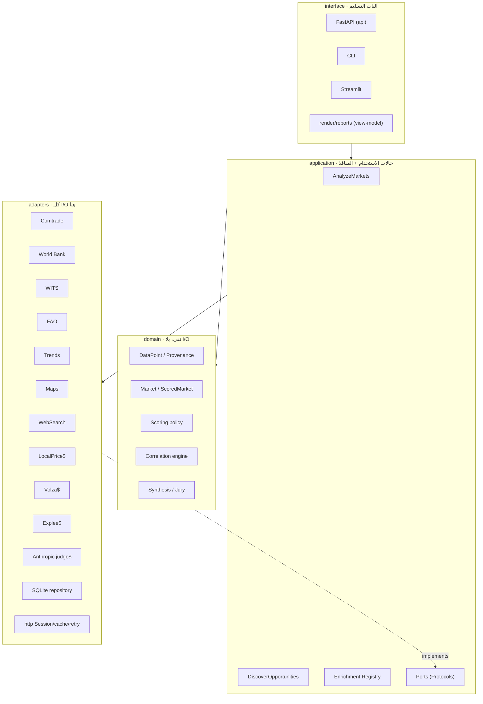

# مقترح إعادة التصميم الشامل — منصة سِلك لذكاء الأسواق
# Global-Standard Redesign Proposal — Silk Market Intelligence

> **الحالة · Status:** مقترح للمراجعة (proposal for review) — *not merged behavior.*
> **المنهج · Method:** كل ادّعاء مرساة إلى `ملف:سطر` على غرار `docs/AUDIT_STATUS.md`؛
> «غير موجود» يُقال صراحة. Every claim is anchored to `file:line`; "not found" is stated explicitly.
> **القاعدة الحاكمة · Governing rule:** التطوير بالدمج المتدرّج لا الهدم (VISION.md §تحذير صريح).
> Evolution by incremental merge, never demolition — this proposal encodes that constraint, it does not violate it.

---

## 0 · ملخّص تنفيذي · Executive Summary

**بالعربية.** منصة سِلك ليست مشروعاً يحتاج إعادة كتابة — بل *مونوليث معياري ناضج* بمبدأ تأسيسي
نادر الانضباط: «لا نختلق بيانات، وكل رقم يحمل مصدره وثقته». هذا المبدأ مفروض بنيوياً عبر
`DataPoint` و٨٧ اختباراً هيرمتياً، وهو **الأصل الأثمن** الذي يجب أن تحميه أي إعادة هيكلة. لذلك
يقترح هذا المستند **تطويراً معمارياً غير كاسر** يرفع البنية إلى معايير Clean/Hexagonal/DDD مع الحفاظ
على السلوك والاختبارات، وإعادة تصميم واجهة كاملة بمبادئ Claude Design (هدوء، حد أدنى، فراغ متوازن).

**In English.** Silk is a **mature modular monolith**, not a rewrite candidate. Its founding principle —
*never fabricate data; every value carries provenance and confidence* — is enforced structurally through
the `DataPoint` value object and 87 hermetic tests. That discipline is the crown jewel any redesign must
protect. This document therefore proposes a **non-breaking architectural evolution** toward Clean /
Hexagonal / DDD standards that preserves all behavior and tests, plus a full **Claude Design** UI redesign.

| المحور · Axis | اليوم · Today | المستهدف · Target | الأثر · Impact |
|---|---|---|---|
| البنية · Structure | 30+ ملف `silk_*.py` مسطّح في الجذر | حزمة `silk/` بطبقات domain/application/adapters/interface | قابلية صيانة، حدود اعتماد واضحة |
| التنسيق · Orchestration | دالة `analyze()` واحدة بـ14 علم `with_*` | سجلّ إثراء تعريفي (Open-Closed) | إضافة طبقة = ملف جديد لا تعديل النواة |
| النموذج · Domain model | قواميس غير مطبوعة تُمرَّر وتُطفَّر | كيانات وقيم مطبوعة (`Market`, `ScoredMarket`) | أمان أنواع، اختبار معزول |
| الأداء · Performance | HTTP متسلسل حاجب | I/O لا-متزامن + تجميع اتصالات | تسريع 3–5× للأسواق المتعددة |
| الواجهة · UI/UX | ملف HTML واحد 989 سطراً، كثيف | نظام تصميم Claude + مكوّنات مفصولة | وضوح، هدوء، ثقة بصرية |
| الأمان · Security | حرّاس قبل الوكلاء (ممتاز) | + تحديد معدّل، ترويسات أمان، Settings مركزية | تقليل سطح DoS/إساءة |

**التوصية للقيادة · Recommendation to leadership:** اعتماد خطة الموجات `R0…R5 + RUI` أدناه.
كل موجة PR مستقل، الاختبارات تبقى خضراء، والقيمة تُسلَّم تدريجياً بلا توقّف للخدمة.
Adopt the `R0…R5 + RUI` wave plan below: one independent PR per wave, suite stays green, value ships
incrementally with zero downtime.

---

## 1 · التدقيق بالمعايير العالمية · Global Best-Practice Audit

### 1.1 نقاط القوة (تُحفَظ، لا تُمَسّ) · Strengths (preserve, do not touch)

| # | القوة · Strength | الدليل · Evidence |
|---|---|---|
| S1 | **مبدأ عدم الاختلاق مفروض بنيوياً** — القيمة المفقودة `None` بثقة `0.0` وملاحظة، لا صفر مخترع | `silk_data_layer.py:137-151` (`primary_value` يرفض عدّ السجل الناقص صفراً)، `silk_data_layer.py:216-222` |
| S2 | **نموذج بيانات بالنسب أولاً** — كل قيمة `DataPoint(value, source, confidence, note, retrieved_at)` | `silk_data_layer.py:58-66` |
| S3 | **الحد البنيوي بين المدفوع والمجاني** — `BaseAgent` يمنع الوكيل المدفوع خارج سياق `/deepen` بلا أي نداء | `silk_agents.py:69-92`, `silk_context` عبر contextvars |
| S4 | **قالب عرض قانوني واحد** — كل المخرجات تشتق من `build_view()` فيستحيل رقم بلا مصدر | `silk_render.py:97-143` |
| S5 | **مدخل حكم وحيد** — التوليف ثنائي المرحلة، الازدواجية القديمة حُذفت عمداً | `silk_engine.py:159-165`, CLAUDE.md §6 |
| S6 | **حرّاس أمان قبل أي وكيل** — مصادقة (401)، سقف مدفوع ذرّي (429)، مفاتيح غير محمية (503)، عزل حقن | `api.py:232-261`, `api.py:89-99` |
| S7 | **استيراد كسول** — كل وحدة تُستورد بلا شبكة وبلا مفتاح؛ اختبارات هيرمتية تقطع الشبكة | `api.py:104-116`, `silk_engine.py:218` وأخواتها |
| S8 | **حوكمة موثّقة** — موجات، ادّعاءات مرساة إلى file:line، عيّنات تُعاد توليداً | `docs/EXECUTION_PLAN.md`, `docs/AUDIT_STATUS.md` |

> **الحكم · Verdict:** هذه ليست ديون تقنية — هي أصول. أي إعادة تصميم تكسر S1–S8 مرفوضة مبدئياً.

### 1.2 الديون التقنية وأنماط مضادّة (مرتّبة بالأثر) · Technical Debt & Anti-patterns (ranked)

| # | المشكلة · Issue | المعيار المنتهَك · Standard violated | الدليل · Evidence | الخطورة |
|---|---|---|---|---|
| D1 | **فضاء أسماء مسطّح** — 30+ `silk_*.py` في الجذر بلا حزمة ولا طبقات | Clean Architecture (حدود الطبقات)، Package cohesion | جذر المستودع؛ لا مجلّد `silk/` | عالية |
| D2 | **نواة تنسيق إجرائية ضخمة** — `analyze()` ~170 سطراً، 14 علَم `with_*`، سلسلة `_enrich_*` | SOLID: Open-Closed + Single-Responsibility؛ Long Parameter List | `silk_engine.py:27-195` | عالية |
| D3 | **تكرار في أغلفة الإثراء** — `_enrich_trends/_tariffs/_faostat/_maps/…` بنفس شكل try/except-per-row | DRY؛ `_enrich_named` عمّم 3 فقط | `silk_engine.py:218-352` | متوسطة |
| D4 | **تسرّب النموذج كقواميس متحوّلة** — `row`/`result`/`task` قواميس تُطفَّر في المكان عبر المراحل | DDD (كيانات/قيم)، الغلاف (encapsulation) | `silk_engine.py:150-169` (`row["jury"]=…`, `row["competitive_position"]=…`) | عالية |
| D5 | **I/O متسلسل حاجب** — الوكلاء يعملون تتابعياً لكل سوق، وكل نداء `requests.get` حاجب بلا Session | Performance، Hexagonal (منافذ قابلة للتبديل لا-متزامنة) | `silk_engine.py:113-116`, `silk_data_layer.py:182,206` | متوسطة-عالية |
| D6 | **آثار جانبية عند الاستيراد** — `_load_dotenv()` و`COMTRADE_KEY` و`app=create_app()` وقت الاستيراد | 12-Factor config، قابلية الاختبار | `silk_data_layer.py:34,50`, `api.py:449` | متوسطة |
| D7 | **ضبط مبعثر** — `os.environ.get(...)` في وحدات متعددة بلا كائن Settings واحد | 12-Factor، مصدر حقيقة واحد | `api.py:64,78,99`, `silk_data_layer.py:50` | متوسطة |
| D8 | **واجهة أمامية أحادية الملف** — 989 سطراً IIFE تخلط الحالة والتخطيط و20+ دالة عرض وأنماطاً كنصوص | فصل الاهتمامات، قابلية الاختبار، Component design | `web/index.html:300-985` | متوسطة |
| D9 | **تخزين بلا منفذ مستودع** — استدعاء `silk_storage` مباشرة من `api.py`/`engine` | Hexagonal (Repository Port)، Dependency Inversion | `api.py:371-435`, `silk_engine.py:377` | منخفضة-متوسطة |
| D10 | **لا أنواع صارمة ولا Lint** — «no linter config» صراحة؛ لا mypy ولا بوابة تغطية | جودة، أمان أنواع | CLAUDE.md §Commands | منخفضة |

### 1.3 الأمان · Security (جيد إجمالاً، ثغرات محدّدة)

**قوي:** مصادقة قبل الوكيل، حجز سقف ذرّي بلا TOCTOU (`api.py:253-261`)، عزل حقن البرومبت
(`silk_ai_judge._isolate`)، حارس المفاتيح غير المحمية 503، CORS نفس-الأصل افتراضاً.

**ثغرات (بترتيب الأولوية):**
- **لا تحديد معدّل على المسار المجاني** — `/analyze`/`/discover` بلا rate-limit؛ سطح DoS واستنزاف حصص Comtrade. *(غير موجود في `api.py`.)*
- **لا ترويسات أمان** — لا `Content-Security-Policy`/`X-Content-Type-Options`/`Referrer-Policy` على الثابت المُقدَّم من `/` (`api.py:440-442`).
- **مقارنة مفتاح غير ثابتة الزمن** — `!=` في `api.py:235` (سطح توقيت ضعيف؛ أثر منخفض لكنه سهل الإصلاح بـ`hmac.compare_digest`).
- **لا حدّ لحجم الطلب/الأسواق** — الترتيب يمسح ~38 سوقاً لكل طلب؛ لا سقف قابل للضبط.

### 1.4 الأداء · Performance
- **العنق الأساسي:** I/O متسلسل. لأعلى 3 أسواق × 3 وكلاء × تدفّقين + مؤشرات البنك الدولي = عشرات جولات HTTP حاجبة متتابعة (`silk_engine.py:113`, `silk_agents.py:111`).
- **لا تجميع اتصالات** — `requests.get` مباشر لكل نداء بلا `requests.Session` (`silk_data_layer.py:182,206`).
- **إيجابي:** ذاكرة قرص شفّافة موجودة (`silk_cache`, `silk_data_layer.py:74-86`).

### 1.5 ضعف UX/UI · UX/UI Weaknesses (مدخل قسم ٣)
- كثافة معلوماتية عالية وصناديق داخل صناديق (`.card` داخل `.duo` داخل `.main`) — إجهاد بصري.
- فراغ ضيّق، حدود كثيرة بدل الفراغ لفصل المجموعات، تباين لون accent مرتفع (`--blue:#2348E2`).
- تسلسل بصري ضعيف بين «القرار» و«الخط» و«الجدول» — كلها بطاقات متساوية الوزن.
- قوّة حقيقية تُبنى عليها: النسب أولاً، إعلان الفجوات، RTL عربي أصيل — نحفظها ونهدّئ حولها.

---

## 2 · إعادة التصميم المعماري · Professional Architecture Redesign

### 2.1 القرار: مونوليث معياري سداسي (لا Microservices)

الخدمات المصغّرة **مبالغة هندسية** لهذا الحجم والفريق ولمبدأ الأداة القياسية أولاً (إضافة ponytail،
`.claude/settings.json`). الصواب: **Hexagonal / Clean داخل حزمة واحدة** — عزل المجال عن I/O عبر منافذ،
مع إبقاء نشر خدمة Railway واحدة. القاعدة الذهبية: **الاعتمادات تشير للداخل**
(`interface → application → domain`؛ `adapters` تحقّق منافذ `application`).



### 2.2 هيكل المجلّدات المقترح · Proposed Folder Structure

```
silk/
├── domain/                     # نقي: بلا شبكة، بلا إطارات — pure, no I/O
│   ├── data_point.py           # DataPoint (frozen) + Provenance + missing() factory
│   ├── market.py               # Market, ScoredMarket, Component (value objects)
│   ├── analysis.py             # AnalysisResult (aggregate root)
│   ├── scoring.py              # WEIGHTS + rank policy (pure functions)
│   ├── correlation/            # ← correlation.py (نقي أصلاً — مطابقة مثالية)
│   └── synthesis.py            # JuryCommittee + verdict policy (نقي)
├── application/                # التنسيق + تعريف المنافذ
│   ├── ports.py                # TradeDataPort, EconomicDataPort, JudgePort, Repository…
│   ├── analyze.py              # use-case: يحل محل جسد engine.analyze
│   ├── discover.py             # use-case: يحل محل silk_discovery
│   └── enrichment/
│       ├── registry.py         # سجلّ تعريفي (Open-Closed)
│       └── layers.py           # تعريف كل طبقة إثراء ككائن بيانات
├── adapters/                   # تحقيق المنافذ — كل I/O والمفاتيح هنا
│   ├── http.py                 # requests.Session + retry + on-disk cache
│   ├── comtrade.py  world_bank.py  wits.py  faostat.py  trends.py
│   ├── maps.py  websearch.py  localprice.py  volza.py  explee.py
│   ├── anthropic_judge.py
│   └── sqlite_repository.py    # يحقّق Repository port
├── agents/                     # BaseAgent + الوكلاء (طبقة رقيقة فوق المنافذ)
│   └── base.py  research.py  enrichment_agents.py
├── interface/
│   ├── api/                    # FastAPI app + routers + security middleware
│   ├── cli.py                  # عرض الطرفية
│   ├── streamlit_app.py
│   └── render/                 # build_view + reports (docx/brief)
├── config.py                   # Settings مطبوع واحد (12-Factor)
└── __init__.py                 # re-export shims للتوافق الخلفي

web/                            # الواجهة (قسم ٣): tokens.css + components + app
tests/                          # كما هي — تبقى هيرمتية وخضراء
```

### 2.3 خريطة الترحيل: القديم → الجديد · Old → New Mapping

| الملف الحالي · Current | الطبقة الجديدة · New layer | ملاحظة |
|---|---|---|
| `silk_data_layer.py` (DataPoint) | `domain/data_point.py` | القيمة تصبح `frozen` + مصنع `missing()` |
| `silk_data_layer.py` (comtrade/WB) | `adapters/comtrade.py`, `adapters/world_bank.py` | تُرجع كيانات المجال |
| `silk_data_layer_v2.py` | `adapters/world_bank.py` (+PPP) | دمج |
| `silk_market_ranker.py` | `domain/scoring.py` (سياسة) + `application/analyze.py` (تنسيق) | فصل السياسة النقية عن الجلب |
| `silk_agents.py` | `agents/base.py` + `agents/research.py` | `BaseAgent` كما هو منطقياً |
| `silk_engine.py` | `application/analyze.py` + `application/enrichment/*` | تفكيك النواة |
| `silk_discovery.py` | `application/discover.py` | |
| `correlation.py` | `domain/correlation/` | نقي أصلاً — نقل بلا تغيير |
| `silk_synthesis.py` / `silk_ai_judge.py` | `domain/synthesis.py` + `adapters/anthropic_judge.py` | فصل السياسة عن نداء كلود |
| `silk_render.py` / `silk_reports.py` | `interface/render/` | |
| `silk_storage.py` / `silk_usage.py` | `adapters/sqlite_repository.py` | خلف Repository port |
| `api.py` / `app.py` | `interface/api/` / `interface/streamlit_app.py` | |
| `silk_*_agent.py` (كل الطبقات) | `adapters/*.py` (+ `agents/enrichment_agents.py`) | I/O ينزل لـadapters |

> **الأثر على المبدأ التأسيسي:** صفر. المنافذ ترجع `DataPoint`؛ الفشل يظل `missing()` بثقة `0.0`.
> اختبارات قطع الشبكة تنتقل كما هي وتبقى الحكم النهائي.

---

## 3 · إعادة تصميم الواجهة بمبادئ Claude Design · Claude Design UI/UX Redesign

المواصفة الكاملة والرموز (design tokens) والمكوّنات في:
- **`docs/redesign/DESIGN_SYSTEM.md`** — النظام: الألوان، الفراغ، الخط، الحركة، خرائط heuristics.
- **`docs/redesign/ui-preview.html`** — عرض حيّ قائم بذاته للمكوّنات المُعاد تصميمها (كود جاهز، إضافي، لا يمسّ `web/index.html`).

### 3.1 المبادئ المطبَّقة · Applied principles

| المصدر · Source | المبدأ · Heuristic | التطبيق في سِلك · Applied to Silk |
|---|---|---|
| Claude Design | هدوء، حد أدنى، فراغ متوازن | لوح محايد دافئ (`--paper`), accent واحد مكتوم, سلّم فراغ 4→8→12→20→32, ظلال أخفّ |
| Apple HIG | الوضوح، الإذعان، العمق | القرار أولاً بحجم بصري مهيمن؛ الكروم يذعن للمحتوى؛ عمق بالطبقات لا بالحدود |
| Material 3 | Type scale + Elevation | سلّم طباعي منضبط (Display/Title/Body/Caption)؛ ارتفاع بالخلفية والظل لا بالإطار |
| NN/g #1 | إظهار حالة النظام | «خط الوكلاء» يبقى — لكنه شريط تقدّم هادئ يشتق من الردّ الفعلي (`web/index.html:574-597`) |
| NN/g #2 | مطابقة اللغة الواقعية | مصطلحات المجال العربية تبقى (سوق، حصة، فجوة معلنة) |
| NN/g #6 | تمييز لا تذكّر | البحث/الاقتراحات تبقى؛ الفجوة تُعرض بملاحظتها الحقيقية في التلميح |
| NN/g #8 | جمالية وحد أدنى | إزالة الصناديق داخل الصناديق؛ الفصل بالفراغ لا الحدود؛ رقم واحد مهيمن للقرار |

### 3.2 قرارات رئيسية · Key redesign decisions
1. **لوح ألوان أهدأ** — استبدال `--blue:#2348E2` عالي التشبّع بأزرق حبري مكتوم `#3D5AFE→#2A2F45`
   على ورق محايد دافئ `#FAFAF7`؛ الحالات (نجاح/تحذير/خطر) بدرجات مخفَّضة التشبّع.
2. **تسلسل: قرار → أدلّة → تفاصيل** — «القرار» يصبح البطل بمساحة ورقم ثقة كبير؛ الجدول والتفاصيل ثانوية.
3. **الفراغ بدل الحدود** — تقليل `border` واستخدام سلّم فراغ ثابت؛ ظل واحد خفيف للارتفاع.
4. **النِسب كنص هادئ ثانوي** — «المصدر · ثقة · تاريخ» بلون مكتوم وحجم أصغر؛ لا يزاحم الرقم.
5. **حركة لطيفة هادفة** — انتقالات 160–200ms بمنحنى `cubic-bezier(.2,.6,.3,1)`، نبض واحد لحالة التشغيل.
6. **RTL أولاً + وضع داكن** — الرموز تُعرّف مرة وتنعكس؛ `prefers-color-scheme` مدعوم في النظام الجديد.

> راجع `ui-preview.html` لرؤية الهيرو والجدول ورقائق النسب وخط الوكلاء بعد إعادة التصميم، فاتح وداكن.

---

## 4 · إعادة هيكلة وحدات مفتاحية · Refactored Key Modules (production-ready samples)

> عيّنات توضّح النمط المستهدف. **لا تُدمج بعد** — تُطبَّق ضمن الموجات (قسم ٥) مع أغلفة توافق.

### 4.1 `DataPoint` كقيمة غير قابلة للتغيير · Immutable value object
**قبل** (`silk_data_layer.py:58-66`): dataclass قابل للتغيير، والفشل يُبنى يدوياً بتكرار في كل موقع.

```python
# silk/domain/data_point.py  — نقي، بلا I/O، غير قابل للتغيير
from __future__ import annotations
from dataclasses import dataclass
import datetime

def _today() -> str:
    return datetime.date.today().isoformat()

@dataclass(frozen=True, slots=True)
class DataPoint:
    """قيمة موثّقة غير قابلة للتغيير — an immutable, provenance-tagged value."""
    value: object
    source: str
    confidence: float
    note: str = ""
    retrieved_at: str = ""

    @property
    def is_present(self) -> bool:
        return self.value is not None

    @classmethod
    def missing(cls, source: str, note: str) -> "DataPoint":
        """الفجوة المعلنة — the ONE way to build an absent value (principle S1)."""
        return cls(None, source, 0.0, note, _today())

    @classmethod
    def observed(cls, value, source: str, confidence: float, note: str = "") -> "DataPoint":
        return cls(value, source, confidence, note, _today())
```
**لماذا:** `frozen` يمنع التطفير الخفي (يعالج D4)؛ `missing()` يوحّد بناء الفجوة في مكان واحد فيقلّل
تكرار «`DataPoint(None, src, 0.0, …)`» المنتشر (`silk_agents.py:80,90`, `silk_data_layer.py:218,222`).

### 4.2 سجلّ الإثراء التعريفي · Declarative enrichment registry (Open-Closed)
**قبل** (`silk_engine.py:119-145` + `218-352`): 14 علَماً و10 دوال `_enrich_*` شبه متطابقة؛ إضافة طبقة
تُعدّل النواة (انتهاك Open-Closed، D2/D3).

```python
# silk/application/enrichment/registry.py
from __future__ import annotations
from dataclasses import dataclass
from typing import Callable
from silk.domain.data_point import DataPoint

@dataclass(frozen=True)
class EnrichmentLayer:
    """طبقة إثراء تعريفية — one additive layer; NEVER changes total_score."""
    key: str                       # المفتاح في صف السوق (row[key])
    flag: str                      # اسم علم التفعيل (with_*)
    source: str                    # وسم المصدر للفجوة
    paid: bool                     # هل تتطلب سياق /deepen
    run: Callable[[dict, dict], object]   # (row, ctx) -> findings

REGISTRY: list[EnrichmentLayer] = []

def register(layer: EnrichmentLayer) -> None:
    REGISTRY.append(layer)

def apply_enrichments(rows, flags: dict, ctx: dict) -> None:
    """طبّق الطبقات المفعّلة — same wrapper discipline for ALL layers (was 10 funcs)."""
    for layer in REGISTRY:
        if not flags.get(layer.flag):
            continue
        for row in rows:
            try:
                row[layer.key] = layer.run(row, ctx)
            except Exception as e:                     # noqa: BLE001
                row[layer.key] = [DataPoint.missing(
                    layer.source, f"enrichment error: {type(e).__name__}: {e}")]
```
```python
# silk/application/enrichment/layers.py  — إضافة طبقة = سطر تسجيل واحد، لا تعديل نواة
from .registry import register, EnrichmentLayer
from silk.adapters import trends, wits

register(EnrichmentLayer("trends", "with_trends", "Google Trends", paid=False,
    run=lambda row, ctx: trends.for_market(ctx["product"], row.get("iso2")).findings))
register(EnrichmentLayer("tariff", "with_tariffs", "World Bank WITS", paid=False,
    run=lambda row, ctx: wits.applied_tariff(ctx["hs_code"], row.get("iso3"), ctx["year"])))
# … بقية الطبقات بنفس السطر الواحد
```
**لماذا:** يزيل ~130 سطراً مكرّراً (`silk_engine.py:218-352`)، ويجعل النواة مغلقة على التعديل
مفتوحة على الامتداد (Open-Closed)، ويوحّد انضباط «الاستثناء ⇒ DataPoint موسوم» في مكان واحد.

### 4.3 منفذ + مُحوِّل · Port + Adapter (Dependency Inversion / Hexagonal)
**قبل:** الوكلاء يستوردون `silk_data_layer` مباشرة (`silk_agents.py:14-22`) — اقتران بالتحقيق.

```python
# silk/application/ports.py  — التطبيق يعرّف ما يحتاج، لا كيف يُجلب
from __future__ import annotations
from typing import Protocol
from silk.domain.data_point import DataPoint

class TradeDataPort(Protocol):
    def imports(self, hs_code: str, market_m49, year: int) -> DataPoint: ...
    def competitors(self, hs_code: str, market_m49, year: int) -> list[DataPoint]: ...

class JudgePort(Protocol):
    def verdict(self, isolated_findings: str) -> dict | None: ...
```
```python
# silk/adapters/comtrade.py  — يحقّق المنفذ؛ كل شبكة/مفاتيح هنا، والفشل = missing()
from silk.domain.data_point import DataPoint
from silk.adapters.http import get_json     # requests.Session + retry + cache

class ComtradeAdapter:                        # implements TradeDataPort
    SOURCE = "UN Comtrade"
    def imports(self, hs_code, market_m49, year) -> DataPoint:
        recs = get_json(...) or []
        vals = [v for r in recs if (v := _primary_value(r)) is not None]
        if not vals:
            return DataPoint.missing(self.SOURCE,
                f"HS{hs_code} imports {market_m49} {year}: no numeric value")
        return DataPoint.observed(sum(vals), self.SOURCE, 0.9, "total imports, USD")
```
**لماذا:** الوكيل/حالة الاستخدام تعتمد على `TradeDataPort` المجرّد لا على `requests`؛ الاختبار يحقن
منفذاً مزيّفاً بلا احتكار socket، والانتقال لـasync يصبح تبديل مُحوِّل خلف نفس المنفذ (يعالج D5/D9).

### 4.4 توزيع لا-متزامن للأسواق · Async market fan-out (performance)
```python
# silk/adapters/http.py  — تجميع اتصالات + لا-تزامن خلف نفس المنفذ
import httpx
_client = httpx.AsyncClient(timeout=30, limits=httpx.Limits(max_connections=16))

async def get_json_async(url, params):
    try:
        r = await _client.get(url, params=params)
        r.raise_for_status()
        return r.json()
    except Exception:                            # noqa: BLE001 — never raise; caller → missing()
        return None
```
```python
# silk/application/analyze.py — 3 أسواق × 3 وكلاء تتوازى بدل التتابع
import asyncio
async def _enrich_top(markets, task_of):
    async def one(row):
        row["reports"] = await asyncio.gather(*(a.run_async(task_of(row)) for a in AGENTS))
    await asyncio.gather(*(one(r) for r in markets))
```
**لماذا:** يحوّل عشرات جولات HTTP الحاجبة المتتابعة (`silk_engine.py:113`) إلى تزامن محدود — تسريع
تقديري 3–5× للأسواق المتعددة. **حرج:** تبقى الاختبارات الهيرمتية تحقن منافذ مزيّفة؛ لا شبكة فعلية،
فلا كسر لعقد «قطع socket» (نُبقي مسار sync متزامناً للاختبارات التي تحقن أخطاء `requests`).

---

## 5 · خطة الترحيل والتنفيذ · Migration & Implementation Plan

نفس انضباط الموجات في المستودع (PR مستقل، اختبارات خضراء، عيّنات تُعاد توليداً، ادّعاءات إلى file:line).

| الموجة · Wave | الهدف · Goal | التسليم · Deliverable | المخاطرة · Risk | التخفيف · Mitigation |
|---|---|---|---|---|
| **R0** | إنشاء حزمة `silk/` + أغلفة re-export | `import silk_data_layer` يظل يعمل عبر shim | كسر مسارات استيراد | shims تُصدِّر الأسماء القديمة؛ لا نقل سلوك |
| **R1** | مجال مطبوع: `DataPoint` frozen + `Market`/`ScoredMarket` | المُحوِّلات ترجع كيانات؛ العرض يبقى قواميس عند الحدود | تطفير خفي معتمَد عليه | إبقاء `build_view` كطبقة تحويل واحدة |
| **R2** | منافذ + نقل I/O لـadapters | الوكلاء يعتمدون منافذ | اقتران خفي | Protocol + حقن؛ اختبار منفذ مزيّف |
| **R3** | سجلّ الإثراء التعريفي | حذف `_enrich_*` الـ10 والـ14 علماً من النواة | فقد سلوك طبقة | اختبار تكافؤ لكل طبقة قبل/بعد |
| **R4** | مُحوِّلات لا-متزامنة + Session pooling | توزيع متوازٍ للأسواق | كسر عقد الاختبارات الهيرمتية | إبقاء مسار sync؛ منافذ مزيّفة في الاختبار |
| **R5** | `config.py` مطبوع + Repository port + تقوية أمان | Settings واحد، rate-limit، ترويسات، `compare_digest` | لوائح ضبط | افتراضات آمنة = وضع تطوير مفتوح بلا مفاتيح مدفوعة (كما اليوم) |
| **RUI** | طرح Claude Design تدريجياً | tokens.css + مكوّنات؛ ثم تبديل `web/index.html` خلف علم | انحدار بصري/سلوكي | `ui-preview.html` أولاً؛ إعادة توليد عيّنات؛ تكافؤ view |

**الاعتماديات · Dependencies:** R1←R0؛ R2←R1؛ R3←R2؛ R4←R2؛ R5 مستقلة نسبياً؛ RUI متوازية تماماً.
**سير العمل الموصى به للفريق · Recommended workflow:** موجتان متوازيتان بحد أقصى (RUI + مسار R)،
مراجعة أقران بادّعاءات مرساة، تجديد `samples/` مع كل تغيير في طبقة العرض (القاعدة §10.6).

**المخاطر الحاكمة · Governing risks:**
1. **كسر المبدأ التأسيسي** — أعلى خطر. تخفيف: كل مُحوِّل يمرّ باختبار «قطع الشبكة ⇒ `missing()`».
2. **ازدواج مسار العرض** — القاعدة تمنعه (§10.1). تخفيف: RUI يستهلك `view` نفسه، لا يبني نموذجاً موازياً.
3. **زحف Postgres/إطارات ثقيلة** — مؤجّل بقرار مالك. تخفيف: SQLite خلف Repository port يكفي.

---

## 6 · التسليمات النهائية · Final Deliverables (index)

| # | التسليم · Deliverable | الموقع · Location |
|---|---|---|
| 1 | مقترح إعادة التصميم الكامل (هذا) | `docs/redesign/REDESIGN_PROPOSAL.md` |
| 2 | مخطّطات المعمارية | §2.1 (Mermaid) + §2.2 (شجرة المجلّدات) |
| 3 | نظام تصميم Claude UI | `docs/redesign/DESIGN_SYSTEM.md` |
| 4 | مكوّنات UI حيّة (فاتح/داكن، RTL) | `docs/redesign/ui-preview.html` |
| 5 | عيّنات كود مُعاد هيكلته | §4.1–4.4 |
| 6 | خطة الترحيل بالموجات + المخاطر | §5 |
| 7 | ملخّص تنفيذي للقيادة/المستثمرين | §0 + Artifact بصري (رابط في وصف الـPR) |

> **خلاصة الحكم:** سِلك مبنية جيداً على مبدأ نادر. المقترح **يرفع البنية والواجهة إلى المعايير العالمية
> دون المساس بما يجعلها موثوقة** — تطوّر بالدمج المتدرّج، لا هدم. Silk is well-built on a rare principle;
> this proposal raises structure and UI to world-class standards **without touching what makes it trustworthy.**
